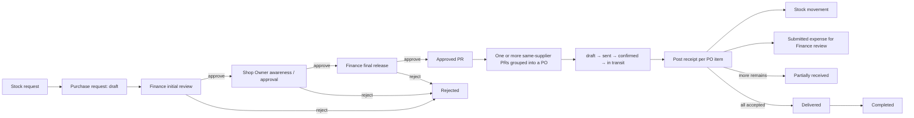

# Inventory and Procurement Workflow

This is the current SME workflow. It tracks what the shop intends to buy, what actually arrived, the stock added, and the expense Finance still needs to review. It intentionally does not include RFQs, bidding, contracts, or enterprise approval configuration.



## State rules

Purchase Request:

```text
draft → pending_finance → pending_shop_owner → pending_finance_final → approved
                                                    ↘ rejected ↙
```

- Finance performs both the initial budget review and final release.
- The Shop Owner step provides awareness and consent; it is not the final financial approval.
- Creating and submitting immediately is allowed only when the user has both permissions, and still ends at `pending_finance`.
- There is no value threshold or background job that skips an approval stage.

Purchase Order:

```text
draft → sent → confirmed → in_transit → partially_received → delivered → completed
```

- A PO may contain one item. It may also group multiple approved PRs when they belong to the same shop and supplier.
- PO item product, quantity, cost, color, size, and inventory targets are server snapshots from approved PRs; the client cannot rewrite them.
- Manual status actions stop at `in_transit`. Only receipt posting can set `partially_received` or `delivered`.
- Draft, sent, confirmed, and in-transit POs can be cancelled only before any receipt is posted. Cancellation releases their PRs for a replacement PO.

## Receiving and Finance

- Record each arrival as a receipt with received and defective quantities per PO item.
- Accepted quantity is `received - defective`. Defective units do not enter usable stock and do not create expense value.
- Partial receipts are supported. Replacements can be received later until every PO item reaches its ordered accepted quantity.
- Each receipt uses an idempotency key, so retrying the same submission cannot duplicate stock or expense effects.
- Inventory updates use the PO item's frozen parent/color/size targets.
- Accepted receipt value creates one Finance expense with status `submitted`; it never auto-approves and does not pre-fill final approver fields.

## Corrections

A manual receipt can be voided only while the PO is not completed and its linked expense is absent, `submitted`, or `rejected`. A reason is required. Voiding creates compensating stock movements, reverses the exact parent/color/size deltas, rejects a submitted expense, cancels any pending approval attached to it, and recalculates the PO from the remaining posted receipts. Historical/migration receipts cannot be voided.

## Canonical and legacy screens

- Canonical purchasing and receiving: `/erp/procurement/purchase-orders`
- Canonical APIs: `/api/erp/procurement/purchase-requests` and `/api/erp/procurement/purchase-orders`
- Supplier Order Monitoring is read-only. Its former write endpoints remain as explicit `410 Gone` responses directing callers to canonical Purchase Orders.
- Unsupported supplier performance, rating, purchase-history, auto-PO, and auto-approval features are not part of this SME module.

Historical size-label cleanup remains documented in [requested-size-label-normalization-checklist.md](requested-size-label-normalization-checklist.md).
