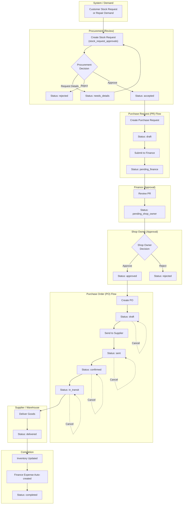

# Inventory and Procurement Workflow (Current State)

This reflects the post-cutover flow where `stock_request_approvals` is the canonical request backbone, with swimlanes showing actor responsibilities.



### Status State Machines

**Stock Request** (Canonical: `/api/erp/procurement/stock-requests`)
```
pending → (needs_details → pending) | accepted | rejected
```

**Purchase Request**
```
draft → pending_finance → pending_shop_owner → approved | rejected
```

**Purchase Order**
```
draft → sent → confirmed → in_transit → delivered → completed
draft | sent | confirmed | in_transit ↝ cancelled
```

## Key Notes

- Canonical request API: `/api/erp/procurement/stock-requests`
- Legacy compatibility API: `/api/erp/procurement/replenishment-requests`
- Legacy `PUT`/`DELETE` on replenishment endpoints return `410 Gone` (deprecated)
- Procurement decision states on stock requests: `pending`, `needs_details`, `accepted`, `rejected`
- PR approval chain: `pending_finance` -> `pending_shop_owner` -> `approved`
- PO delivery updates inventory and auto-creates finance expense
- One-time production data fix checklist for historical size labels: [requested-size-label-normalization-checklist.md](requested-size-label-normalization-checklist.md)
